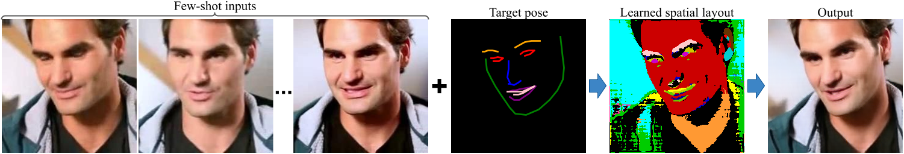
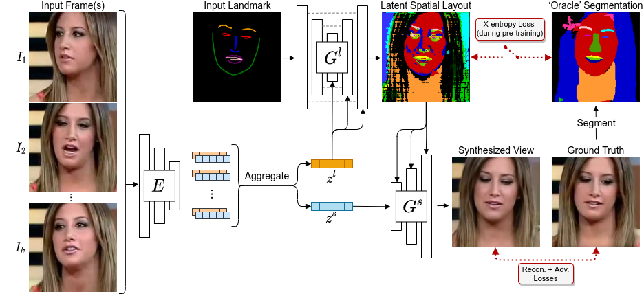

# LSR: Learned Spatial Representations for Few-shot Talking-Head Synthesis


<figure class="image">
  
</figure>

Official code release for LSR. For technical details, please refer to:

**Learned Spatial Representations for Few-shot Talking Head Synthesis.** <br>
[Moustafa Meshry](http://www.cs.umd.edu/~mmeshry/), [Saksham Suri](http://www.cs.umd.edu/~sakshams/), [Larry S. Davis](http://users.umiacs.umd.edu/~lsd/), [Abhinav Shrivastava](http://www.cs.umd.edu/~abhinav/) <br>
In International Conference on Computer Vision (ICCV), 2021.

[**Paper**](https://arxiv.org/abs/2104.14557) | [**Project page**](http://www.cs.umd.edu/~mmeshry/projects/lsr/) | [**Video**](https://youtu.be/eL_5YLixxrQ)


If you find this code useful, please consider citing:
```
@inproceedings{meshry2021step,
  title = {Learned Spatial Representations for Few-shot Talking-Head Synthesis},
  author = {Meshry, Moustafa and
          Suri, Saksham and
          Davis, Larry S. and
          Shrivastava, Abhinav},
  booktitle = {Proceedings of the IEEE/CVF International Conference on Computer Vision (ICCV),
  year = {2021}
}
```

## Environment setup

The code was built using `tensorflow 2.2.0`, cuda `10.1.243`, and cudnn `v7.6.5`, but should be compatible with more recent tensorflow releases and cuda versions.
To set up a virtual environement for the code, follow the following instructions.
- Create a new conda environment
```
conda create -n lsr python=3.6
```
- Activate the `lsr` environment
```
conda activate lsr
```
- Set up the prerequisites
```
pip install -r requirements.txt
```
<br>

## Run a pre-trained model
- Download our [pretrained model](https://drive.google.com/file/d/1PXRdeKgEIBsPeoMjFJcIZq00V_1RitJZ/view?usp=sharing) and extract to `./_trained_models/meta_learning`
- To run the inference for a test identity, execute the following command:
```
python main.py \
    --train_dir=_trained_models/meta_learning \
    --run_mode=infer \
    --K=1 \
    --source_subject_dir=_datasets/sample_fsth_eval_subset_processed/train/id00017/OLguY5ofUrY/combined \
    --driver_subject_dir=_datasets/sample_fsth_eval_subset_processed/test/id00017/OLguY5ofUrY/combined \
    --few_shot_finetuning=false 
```
where `--K` specifies the number of few-shot inputs, `--few_shot_finetuning` specifies whether or not to fine-tune the meta-learned model using the the K-shot inputs, and `--source_subject_dir` and `--driver_subject_dir` specify the source identity and driver sequence data respectively.
Each output image contains a tuple of 5 images represeting the following (concatenated along the width):
- The input facial landmarks for the target view.
- The output discrete layout of our model, visualized in RGB.
- The oracle segmentation map using an off-the-shelf segmentation model (i.e. the pesuedo ground truth), visualized in RGB.
- The final output of our model.
- The ground truth image of the driver subject.

A sample tuple is shown below.

&nbsp; &nbsp; &nbsp; &nbsp; **Input landmarks** &nbsp; &nbsp; &nbsp; &nbsp; &nbsp; **Output spatial map** &nbsp; &nbsp; &nbsp; &nbsp; &nbsp; **Oracle segmentation** &nbsp; &nbsp; &nbsp; &nbsp;  &nbsp; &nbsp; &nbsp; &nbsp; &nbsp; **Output** &nbsp; &nbsp; &nbsp; &nbsp; &nbsp; &nbsp; &nbsp; &nbsp; &nbsp; &nbsp; &nbsp; &nbsp; &nbsp; **Ground truth**
<figure class="image">
  
</figure>
<br>

## Test data and pre-computed outupts
Our model is trained on the train split of the [VoxCeleb2 dataset](https://www.robots.ox.ac.uk/~vgg/data/voxceleb/vox2.html).
The data used for evaluation is adopted from the "[Few-Shot Adversarial Learning of Realistic Neural Talking Head Models](https://arxiv.org/abs/1905.08233)" paper (Zakharov et. al, 2019), and can be downloaded from the [link](https://drive.google.com/drive/folders/1PeGG6zO3ZjrHk2GAXItB8khwMhPPyDHe) provided by the authors of the aforementioned paper.

The test data contains 1600 images of 50 test identities (not seen by the model during training). Each identity has 32 input frames + 32 hold-out frames.
The K-shot inputs to the model are uniformly sampled from the 32 input set. If the subject finetuning is turned on, then the model is finetuned on the K-shot inputs. The 32 hold-out frames are never shown to the finetuned model.
For more details about the test data, refer to the aforementioned paper (and our paper).
To facilitate comparison to our method, we provide a [link](https://drive.google.com/file/d/1ndtq5GNI1Flglm2XvePgdhQ74Zl36YLh/view?usp=sharing) with our pre-computed outputs of the test subset for K={1, 4, 8, 32} and for both the subject-agnostic (meta-learned) and subject-finetuned models. For more details, please refer to the README file associated with the released outputs.
Alternatively, you can run our pre-trained model on your own data or re-train our model by following the instructions for training, inference and dataset preparation.
<br>


## Dataset pre-processing
The dataset preprocessing has the following steps:
1) Facial landmark generation
2) Face parsing
3) Converting the VoxCeleb2 dataset to tfrecords (for training).

We provide details for each of these steps.

### Facial Landmark Generation

- The landmark generation uses the [face-alignment github repository](https://github.com/1adrianb/face-alignment) which should be installed if you have followed the "[Environment setup](https://github.com/MoustafaMeshry/lsr#environment-setup)" instuctions above. If you face any problems, please refer to the instruction in the [face-alignment github repository](https://github.com/1adrianb/face-alignment) for guidance.

- Run the `preprocessing/landmarks/release_landmark.py` file with the options provided.
1. `data_dir`: Path to a directory containing data to be processed.
2. `output_dir`: Path to the output directory where the processed data should be saved.
3. `k`: Sampling rate for frames from video (Default is set to 10)
4. `mode`: The mode can be set to images or videos depending on whether the input data is video files or already extracted frames.

Here are example commands that process the sample data provided with this repository:

*Note*: Make sure the folders only contain the videos or images that are to be processed.

- Generate facial landmarks for sample VoxCeleb2 test videos.
```
python preprocessing/landmarks/release_landmark.py \
    --data_dir=_datasets/sample_test_videos \
    --output_dir=_datasets/sample_test_videos_processed \
    --mode=videos
```
To process the full `dev` and `test` subsets of the VoxCeleb2 dataset, run the above command twice while setting the `--data_dir` to point to the downloaded `dev` and `test` splits respectively.

- Generate facial landmarks for the train portion of the sample evaluation subset.
```
python preprocessing/landmarks/release_landmark.py \
    --data_dir=_datasets/sample_fsth_eval_subset/train \
    --output_dir=_datasets/sample_fsth_eval_subset_processed/train \
    --mode=images
```
- Generate facial landmarks for the test portion of the sample evaluation subset.
```
python preprocessing/landmarks/release_landmark.py \
    --data_dir=_datasets/sample_fsth_eval_subset/test \
    --output_dir=_datasets/sample_fsth_eval_subset_processed/test \
    --mode images
```
To process the full evaluation subset, download the [evaluation subset](https://drive.google.com/file/d/1ndtq5GNI1Flglm2XvePgdhQ74Zl36YLh/view?usp=sharing), and run the above commands on the `train` and `test` portions of it.

### Facial Parsing

The facial parsing step generates the oracle segmentation maps. It uses face parser of the [CelebAMask-HQ github repository](https://github.com/switchablenorms/CelebAMask-HQ)

To set it up follow the instructions below, and refer to instructions in the [CelebAMask-HQ github repository](https://github.com/switchablenorms/CelebAMask-HQ) for guidance.

```
mkdir third_party
git clone https://github.com/switchablenorms/CelebAMask-HQ.git third_party
cp preprocessing/segmentation/* third_party/face_parsing/.
```

To process the sample data provided with this repository, run the following commands.

- Generate oracle segmentations for sample VoxCeleb2 videos.
```
python -u third_party/face_parsing/generate_oracle_segmentations.py \
    --batch_size=1 \
    --test_image_path=_datasets/sample_test_videos_processed
```

- Generate oracle segmentations for the train portion of the sample evaluation subset.
```
python -u third_party/face_parsing/generate_oracle_segmentations.py \
    --batch_size=1 \
    --test_image_path=_datasets/sample_fsth_eval_subset_processed/train
```

- Generate oracle segmentations for the test portion of the sample evaluation subset.
```
python -u third_party/face_parsing/generate_oracle_segmentations.py \
    --batch_size=1 \
    --test_image_path=_datasets/sample_fsth_eval_subset_processed/test
```

### Converting VoxCeleb2 to tfrecords.
To re-train our model, you'll need to export the VoxCeleb2 dataset to a `TF-record` format.
After downloading the VoxCeleb2 dataset and generating the facial landmarks and segmentations for it, run the following commands to export them to tfrecods.
```
python data/export_voxceleb_to_tfrecords.py \
  --dataset_parent_dir=<path/to/processed_voxceleb2> \
  --output_parent_dir=<path/to/tfrecords/output/directory> \
  --subset=dev \
  --num_shards=1000
```

For example, the command to convert the sample data provided with this repository is
```
python data/export_voxceleb_to_tfrecords.py \
  --dataset_parent_dir=_datasets/sample_fsth_eval_subset_processed \
  --output_parent_dir=_datasets/sample_fsth_eval_subset_processed/tfrecords \
  --subset=test \
  --num_shards=1
```
<br>


## Training

<figure class="image">
  
</figure>


Training consists of two stages: first, we bootstrap the training of the layout generator by training it to predict a segmentation map for the target view.
Second, we turn off the semantic segmentation loss and train our full pipeline.
Our code assumes the training data in a tfrecord format (see previous instructions for dataset preparation). 

After you have generated the `dev` and `test` tfrecords of the VoxCeleb2 dataset, you can run the training as follows:
- run the layout pre-training step: execute the following command
```
sh scripts/train_lsr_pretrain.sh
```
- train the full pipeline: after the pre-training is complete, run the following command
```
sh scripts/train_lsr_meta_learning.sh
```
Please, refer to the training scripts for details about different training configurations and how to set the correct flags for your training data.

